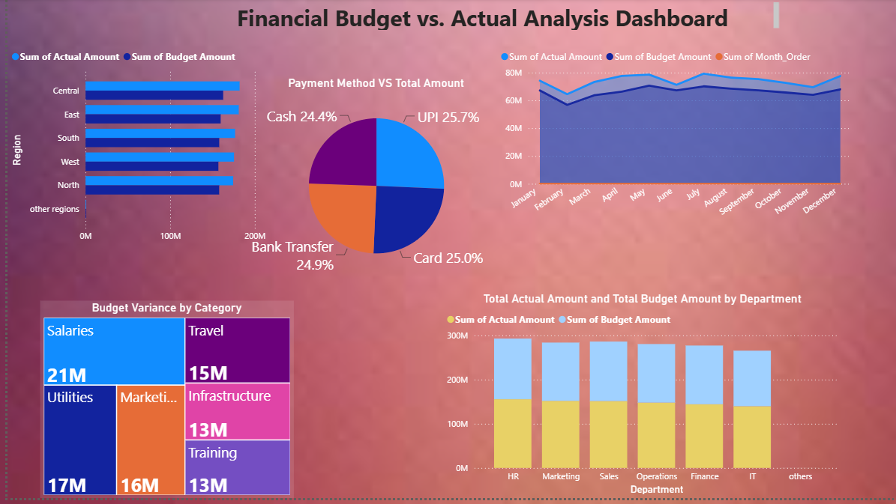

# financial-budget-vs-actual-analysis-PowerBI
# 📊 Financial Budget vs. Actual Analysis Dashboard

A dynamic Power BI dashboard  analysing more than 10,000 dataset designed to track organizational spending, evaluate regional resource allocation, and identify departmental budget overruns using advanced DAX calculations.

Data Source kaggle-Budget vs Actual Financial Dataset

## 🚀 Key Insights & Features
Data Cleaning and Transformation extracted month and year from rwa date, removed duplicates,null values added added new measure of budget variance.
* **Budget vs. Actual Variance Analysis:** Modeled custom DAX metrics (`Budget Variance` & `Variance %`) to track exactly where expenditures exceed or remain within allocations.
* **Chronological Expense Tracking:** Implemented custom sort configurations to align tracking metrics cleanly over a 12-month fiscal timeline.
* **Categorical Drill-Downs:** Engineered an expandable interactive matrix layout for deep-dives from high-level department metrics down to individual transaction channels (e.g., Travel, Salaries).
* **Payment Method Preferences:** Visualized transactional breakdowns across UPI, Cards, and Cash channels to discover process optimization opportunities.

## 🛠️ Tech Stack & Tools
* **BI Tool:** Power BI Desktop
* **Data Transformation:**  deduplication, null-value replacement, and temporal extraction.
  
## 📦 How to View the Project
1. Download the `.pbix` file repository from this project folder.
2. Open the file directly inside **Power BI Desktop**.

View Link of the project- https://1drv.ms/u/c/964b16fd6b676228/IQAi_l9kkRi9SpeG0AXlHiBTAR8EW6VFoMgrq3OmtkCY1kk?e=0e9XeV

